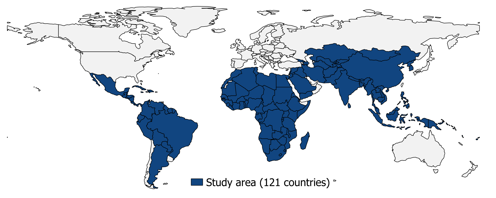
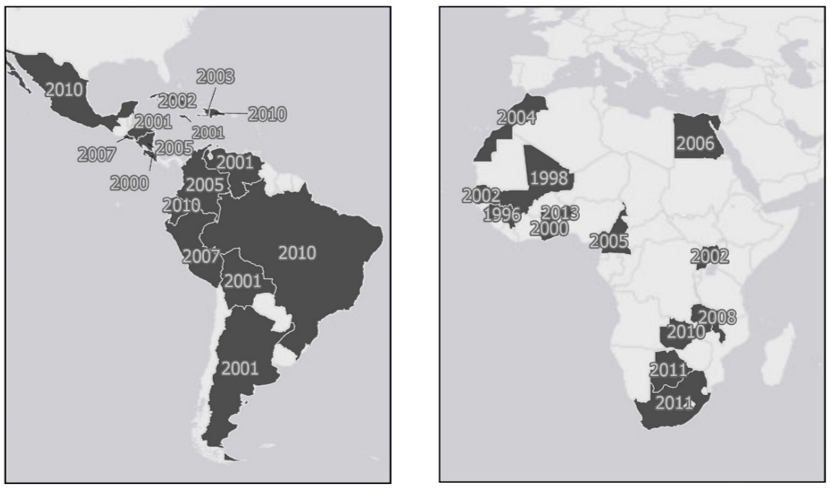
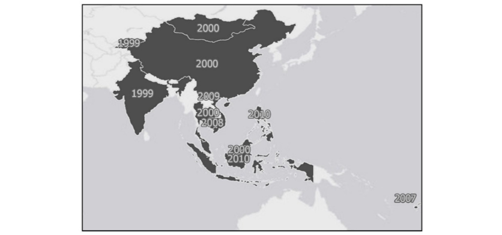

## Rationale
The lack of coherent and comparable data on migration restricts our ability to design appropriate migration and development policies, protect and assist migrant populations, and monitor progress towards the achievement of migration-relevant targets in the Sustainable Development Goals (SDGs). This is particularly true for migration movements across the Global South, international migration movements at the subnational-unit level (i.e. between spatial units located in different countries), and migration data disaggregated by basic characteristic such as sex.

This project aims to address this challenge by providing a new globally consistent and harmonized dataset of sex-disaggregated migration movements estimates at the subnational level within and between all low- and middle-income countries. The new dataset is available <a href="ftp://ftp.worldpop.org.uk/tmp/FDFA_Subnational_MigrationEstimates/" target="_blank">here</a>. This dashboard provides interactive mapping and visualization of this new dataset. 


## Study area
The dataset is available for 121 countries of the Global South shown on Map [1]{#countries-covered}.^[At the time of writing (2018), the World Bank classifies 124 countries as low- or middle-income in Africa, Asia, and Latin American and the Caribbean, based on their gross national income per capita. For five of those (i.e. American Samoa, Dominica, Marshall Islands, Nauru, and Tuvalu) no international migration data are currently available while for a further two of them (i.e. Kiribati and Maldives) there are no subnational administrative units available. This leaves 117 low- and middle-income countries where all necessary data for modelling gender-disaggregated international migration at subnational level are available. In addition to those 117 countries, three additional countries (Argentina, Saudi Arabia, and South Korea) and two French overseas departments (Mayotte and French Guiana), which were included in a previous migration modelling effort performed in the framework of a research project funded by the Bill and Melinda Gates Foundation, have been considered in the framework of this project as well. Thus, all necessary data collection and preprocessing has been carried out for all 121 countries shown on Map [1]{#countries-covered}]

<center>
```{r countries-covered, echo=FALSE, warning=FALSE,fig.cap="Map 1: Study area", out.width = '80%'}

```
</center>

## Definitions

### *Migration*
Following Dennett & Wilson (2013), internal “interregional” migration flows are defined here as the migration flows between subnational administrative units located within the same country (internal migration flows). Similarly, international “interregional” migration flows are defined here as the migration flows between subnational administrative units located in different countries (international migration flows at the subnational level).

An internal migrant is defined here as an individual who has a different administrative unit of usual residence, within a given country, during the census year in comparison to five years prior to the census. Sex-disaggregated internal “interregional” migration flows, mostly between Level 1 administrative units, were estimated using 5-year migration data for 40 countries extracted from census microdata available through the IPUMSI database (Ceaușu et al., in preparation). For each country, the use of migration data collected during the 2010 round of population and housing censuses (spanning the period 2005 to 2014) was prioritized in order to produce estimates that are representative of the 2005-2010 period as best as possible. However, migration data collected during the 2000 round had to be used for 20 countries for which migration data collected during the 2010 round were not available The statistical relationships identified between the migration flows of the 40 countries and a number of geospatial, environmental, and socioeconomic factors were used to estimate internal migration flows for a total of 121 countries. 

An international migrant is defined here as an individual who has a different usual country of residence in 2010 compared with 2005. Following the extension of Azose & Raftery (2019) on the method of Abel and Sander (2014), country-to-country sex-disaggregated international flow estimates were produced from changes in UNDESA sex-disaggregated bilateral migrant stock data between 2005 and 2010 (2017 Revision).

Finally, sex-disaggregated international “interregional” migration flow estimates were produced by combining the country-to-country sex-disaggregated international flow estimates with the corresponding sex-disaggregated internal “interregional” migration flow estimates (Ceaușu et al., in preparation). Following Dennett & Wilson (2013), this was done by assuming that, for each country, the subnational spatial distribution of internal out-migrants and in-migrants is the same as the subnational spatial distribution of international emigrants and immigrants. In other words, it was assumed that for each administrative unit in the country of origin, the proportion of internal out-migrants matches the proportion of international emigrants. Similarly, it was assumed that for each administrative unit in the country of destination, the proportion of internal in-migrants matches the proportion of international immigrants.

### *Administrative unit*
An administrative unit is a country subdivision: a "country may be divided into provinces, states, counties, cantons or other sub-units, which, in turn, may be divided in whole or in part into municipalities, counties or others" (<a href="https://en.wikipedia.org/wiki/Administrative_division" target="_blank">Wikipedia</a>).

Level 1 and 2 administrative units are used for most countries. These level 1 administrative units are called *regions* in Tanzania and *provinces* in the Democratic Republic of Congo, for instance.

### *Estimates*
These migration figures are derived from statistical models and are meant to be *estimates*. See tab the tab **Internal migration estimates** for as summary of the goodness of fit of the models.

These *estimates* are based on the 2000 and 2010 rounds of census (see Map [2]{#census-year-LAC} and [3]{#census-year-Asia}). Hence, the estimates won't capture migration out of Syria in the follow-up of the current Syrian crisis for instance.

When referring to the migration estimates, one needs to assume that the main drivers and directions of migration have not changed since 2010.

<center>
```{r census-year-LAC, echo=FALSE, warning=FALSE,fig.cap="Map 2: Years of censuses used in this study in Latin America, Caribbean and Africa", out.width = '80%'}


```
</center>


<center>
```{r census-year-Asia, echo=FALSE, warning=FALSE,fig.cap="Map 3: Years of censuses used in this study in Asia", out.width = '80%'}

```
</center>


## Data sources and methods
The estimates are built upon three core bodies of data:

1.    IPUMSI database: It contains data on migration for 40 low- and middle-income countries (<a href=https://international.ipums.org/international/ target="_blank">IMPUMSI database</a>, see the Tab on  **Internal migration estimates** for details)
2.    Geospatial covariates: A suite of covariates, representing pull and push factors known to influence internal migration, derived from globally available GIS- and Remote Sensing-based datasets (see the tab **Geographic Information System (GIS) Covariates** for details)
3.    Gender Disaggregated Country Level International Migration Flows estimates (hereafter, ADRI database): Country level gender-disaggregated international migration estimates produced by Professor Guy Abel, ADRI, Shanghai University, China (Abel, <a href=https://onlinelibrary.wiley.com/doi/abs/10.1111/imre.12327 target="_blank">2018</a>,
Azose & Raftery, <a href=https://www.pnas.org/content/116/1/116 target="_blank">2019</a>,
see the Tab **International migration estimates** for details).

The approach can be summarised in three main steps:

1.    Fit statistical models on internal migration for the 40 IPUMSI countries for males and females separately (Sorichetta et al, <a href="https://www.nature.com/articles/sdata201666" target="_blank">2016</a>). Data for the model: the geospatial covariates and migration data extracted from the IPUMSI database.
2.    Predict gender-disaggregated internal migration flows for the 81 low- and middle-income countries for which no IPUMSI migration data are available (Sorichetta et al, <a href="https://www.nature.com/articles/sdata201666" target="_blank">2016</a>). Data for the model: the geospatial covariates and the model parameters estimated in step 1.
3.    Estimate gender-disaggregated international migration flows between administrative units located in different countries by spatially disaggregating the country level international migration estimates from the ADRI database across pair of administrative units using an Iterative Proportional Fitting (IPF) procedure and the spatial distribution of the internal migration estimates as a guide  for the IPF (Dennett and Wilson, <a href= <https://journals.sagepub.com/doi/10.1068/a45398" target="_blank">2013</a>). Data for the model: the ADRI database and internal migration estimates from step 2.


## Data Recommended Citation
Silvia Ceaușu, Dorothea Woods, Chigozie E. Utazi, Guy J. Abel, Xavier Vollenweider, Andrew J. Tatem, Alessandro Sorichetta (2019). Mapping gender-disaggregated migration movements at subnational scales in and between low- and middle-income countries - Funded by the Swiss Confederation, represented by the Federal Department of Foreign Affairs (FDFA), Human Security Division. https://dx.doi.org/10.5258/SOTON/WP00673

## References
Abel, G. J., & Sander, N. (2014). Quantifying Global International Migration Flows. Science, 343(6178), 1520–1522.
Azose, J. J., & Raftery, A. E. (2015). Bayesian probabilistic projection of international migration. Demography, 52(5), 1627-1650.
Ceaușu et al., (in preparation). Modelling sex-disaggregated internal migration flows in low- and middle-income countries.
Ceaușu et al., (in preparation). Estimating sex-disaggregated interregional migration in the Global South.
Dennett, A., & Wilson, A. (2013). A multilevel spatial interaction modelling framework for estimating interregional migration in Europe. Environment and Planning A, 45(6), 1491-1507.
