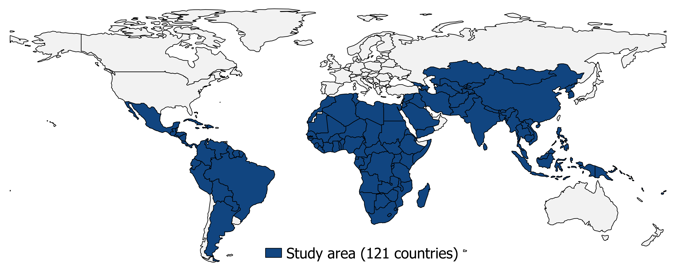

Rationale
---------

The lack of coherent and comparable data on migration restricts our
ability to design appropriate migration and development policies,
protect and assist migrant populations, and monitor progress towards the
achievement of migration-relevant targets in the Sustainable Development
Goals (SDGs). This is particularly true for migration movements across
the Global South, international migration movements at the
subnational-unit level (i.e. between spatial units located in different
countries), and migration data disaggregated by basic characteristic
such as sex.

This project aims to address this challenge by providing a new globally
consistent and harmonized dataset of sex-disaggregated migration
movements estimates at the subnational level within and between all low-
and middle-income countries. The new dataset is available
<a href="ftp://ftp.worldpop.org.uk/tmp/FDFA_Subnational_MigrationEstimates/" target="_blank">here</a>.
This dashboard provides interactive mapping and visualization of this
new dataset.

Study area
----------

The dataset is available for 121 countries of the Global South shown on
Map 1.[1]

Map 1: Study area

Definitions
-----------

### *Migration*

An *international* migrant is defined here as a person who has **changed
country of residence within 5 years**. For instance, a person having
migrated from country *A* to country *B* and having resided less than 2
years in country *B* is counted as an international migrant, but a
person having migrated 10 years ago in country *B* is not considered as
a migrant anymore.

Similarly, an *internal* migrant is defined here as a person who has
**changed administrative unit of residence within 5 years prior to
census**.

These figures provide hence medium term migration movements.

### *Administrative unit*

An administrative unit is a country subdivision: a "country may be
divided into provinces, states, counties, cantons or other sub-units,
which, in turn, may be divided in whole or in part into municipalities,
counties or others"
(<a href="https://en.wikipedia.org/wiki/Administrative_division" target="_blank">Wikipedia</a>).

Level 1 and 2 administrative units are used for most countries. These
level 1 administrative units are called *regions* in Tanzania and
*provinces* in the Democratic Republic of Congo, for instance.

### *Estimates*

These migration figures are derived from statistical models and are
meant to be *estimates*. See tab the tab **Internal migration
estimates** for as summary of the goodness of fit of the models.

These *estimates* are based on the 2000 and 2010 rounds of census (see
Map 2 and 3). Hence, the estimates won't capture
migration out of Syria in the follow-up of the current Syrian crisis for
instance.

When referring to the migration estimates, one needs to assume that the
main drivers and directions of migration have not changed since 2010.

Map 2: Years of censuses used in this study in Latin America, Caribbean
and Africa

Map 3: Years of censuses used in this study in Asia

Data sources and methods
------------------------

The estimates are built upon three core bodies of data:

1.  IPUMSI database: It contains data on migration for 40 low- and
    middle-income countries
    (<a href=https://international.ipums.org/international/ target="_blank">IMPUMSI
    database</a>, see the Tab on **Internal migration estimates** for
    details)
2.  Geospatial covariates: A suite of covariates, representing pull and
    push factors known to influence internal migration, derived from
    globally available GIS- and Remote Sensing-based datasets (see the
    tab **Geographic Information System (GIS) Covariates** for details)
3.  Gender Disaggregated Country Level International Migration Flows
    estimates (hereafter, ADRI database): Country level
    gender-disaggregated international migration estimates produced by
    Professor Guy Abel, ADRI, Shanghai University, China (Abel,
    <a href=https://onlinelibrary.wiley.com/doi/abs/10.1111/imre.12327 target="_blank">2018</a>,
    Azose & Raftery,
    <a href=https://www.pnas.org/content/116/1/116 target="_blank">2019</a>,
    see the Tab **International migration estimates** for details).

The approach can be summarised in three main steps:

1.  Fit statistical models on internal migration for the 40 IPUMSI
    countries for males and females separately (Sorichetta et al,
    <a href="https://www.nature.com/articles/sdata201666" target="_blank">2016</a>).
    Data for the model: the geospatial covariates and migration data
    extracted from the IPUMSI database.
2.  Predict gender-disaggregated internal migration flows for the 81
    low- and middle-income countries for which no IPUMSI migration data
    are available (Sorichetta et al,
    <a href="https://www.nature.com/articles/sdata201666" target="_blank">2016</a>).
    Data for the model: the geospatial covariates and the model
    parameters estimated in step 1.
3.  Estimate gender-disaggregated international migration flows between
    administrative units located in different countries by spatially
    disaggregating the country level international migration estimates
    from the ADRI database across pair of administrative units using an
    Iterative Proportional Fitting (IPF) procedure and the spatial
    distribution of the internal migration estimates as a guide for the
    IPF (Dennett and Wilson,
    <a href= <https://journals.sagepub.com/doi/10.1068/a45398" target="_blank">2013</a>).
    Data for the model: the ADRI database and internal migration
    estimates from step 2.

[1] At the time of writing (2018), the World Bank classifies 124
countries as low- or middle-income in Africa, Asia, and Latin American
and the Caribbean, based on their gross national income per capita. For
five of those (i.e. American Samoa, Dominica, Marshall Islands, Nauru,
and Tuvalu) no international migration data are currently available
while for a further two of them (i.e. Kiribati and Maldives) there are
no subnational administrative units available. This leaves 117 low- and
middle-income countries where all necessary data for modelling
gender-disaggregated international migration at subnational level are
available. In addition to those 117 countries, three additional
countries (Argentina, Saudi Arabia, and South Korea) and two French
overseas departments (Mayotte and French Guiana), which were included in
a previous migration modelling effort performed in the framework of a
research project funded by the Bill and Melinda Gates Foundation, have
been considered in the framework of this project as well. Thus, all
necessary data collection and preprocessing has been carried out for all
121 countries shown on Map 1
