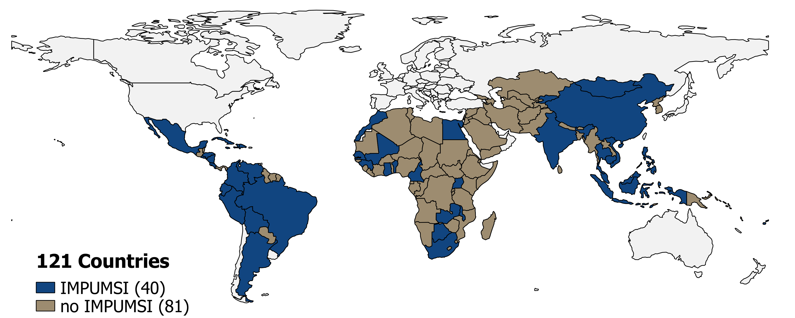
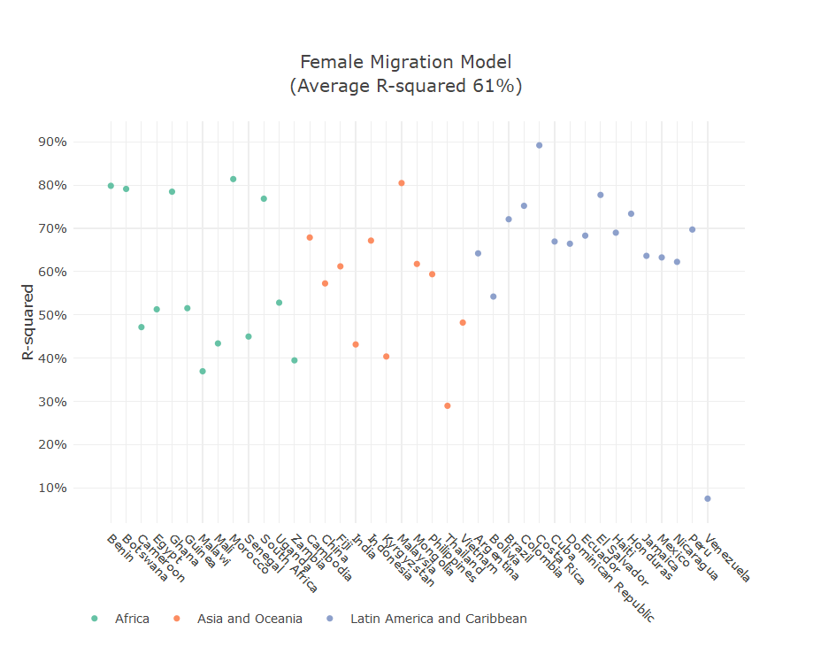
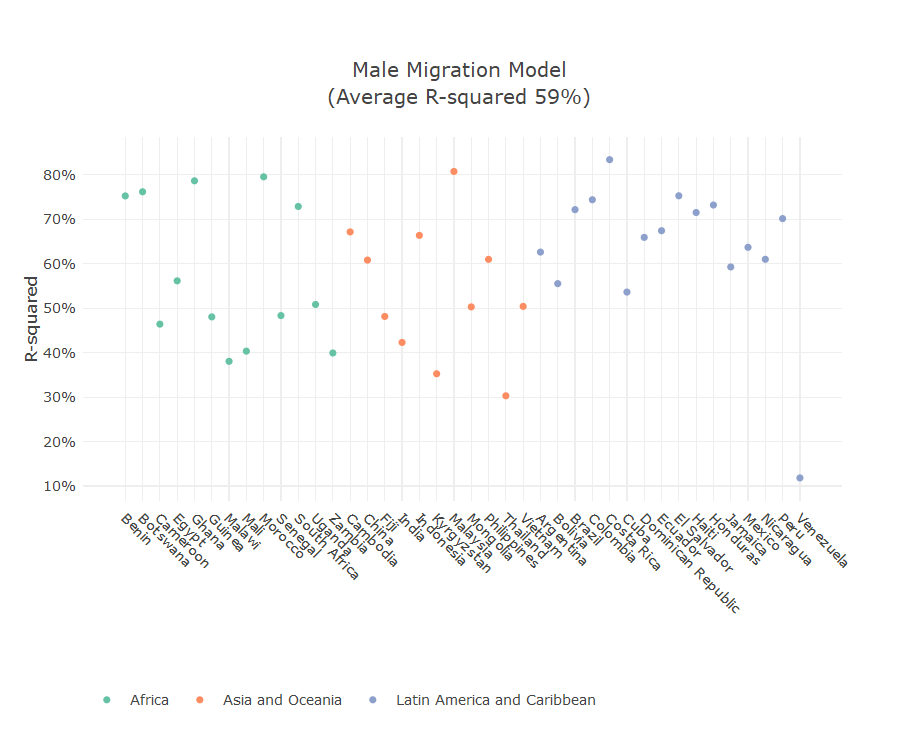

## Internal migration estimates
The goal is to estimate sex-disaggregated internal migration movements at the subnational level, i.e. male and female migration movements between administrative units located in the same countries.

The data on internal migration comes from censuses conducted between 1996 and 2013 in Global South countries and harmonised by the IMPUMS-I program. As only a subset of countries collected information on internal migration in their census, data on internal migration are available for only 40 countries in the <a href="ftp://https://international.ipums.org/international/" target="_blank">IMPUMS-I database </a>. In order to obtain consistent figures on internal migration for the set of 121 Global South countries, two models were used: one for male and one for female migration.

The male and female migration models leverage statistical relationships  between on, one side, internal migration movements observed in the aforementioned 40 countries and, on the other side, pull and push migration factors known to influence internal migration and for which data are available in all 121 countries. Pull and push factors include GDP, distance, contiguity, proportion of urban and rural population, GDP among others.

Once the male and female migration models are calibrated on the set of 40 countries where both internal migration data and pull and push migration factors data are available, it is used to predict migration on the entire set of 121 countries where only pull and push migration factors data are available. For each pair of administrative units within a country, the internal migration figures displayed on the dashboard are predictions of the female and male migration models. These figures are hence *estimates*.

### Internal migration data
The 40 Global South countries with internal migration data harmonised by IMPUMS-I are shown on the *map 1* and listed the final report (see here). 


<center>
```{r census-year-LAC, echo=FALSE, warning=FALSE,fig.cap="Map 1: Study area split into countries with and without IPUMSI census data", out.width = '80%'}



```
</center>

For most of the low- and middle-income countries available through the online IPUMSI database, internal migration data were recorded by asking respondents about either their administrative unit of residence within 5 years prior to the census, or their previous residence and the number of years residing in the current administrative unit.

For each of the 40 countries, harmonised, census-based 5-year internal migration data were extracted from the most recent census microdata available through the IPUMSI database (2019), downloaded locally, and eventually uploaded into a PostgreSQL database using a Microsoft Visual Studio 2010/2017 user interface. The IPUMSI data stored in the PostgreSQL database were weighted to ensure representativeness and subsequently queried, using SQL, to identify all males and females that migrated from each subnational administrative unit of origin to every other subnational administrative unit of destination during the 5-year timespan.

For each county, these numbers were then matched to the corresponding administrative unit spatial dataset, extracted from either the Database of Global Administrative Areas (GADM, 2018) or the Global Administrative Unit Layer (GAUL, 2015) database. This was done by adding a unique "ID" to each spatial unit to match the corresponding IPUMSI-based unit in the PostgreSQL database^[In some cases, depending on the country, spatially contiguous units in the corresponding administrative unit dataset were merged together to match the lower spatial detail of the source migration data. For some countries, spatially contiguous units were merged together to match the re-organization of the country's administrative units during the 5 years prior to the census.].

### Pull and push migration factors data
A set of 8 geospatial datasets representing pull and push migration factors, known to influence internal migration (Garcia et al. <a href="https://eprints.soton.ac.uk/367712/" target="_blank">2014</a>; Sorichetta et al, <a href="https://www.nature.com/articles/sdata201666" target="_blank">2016</a>), were used to improve the fit and prediction power of the gravity model originally proposed by Zipf (<a href="https://www.jstor.org/stable/2087063?seq=1" target="_blank">1946</a>). They are listed below along with the covariates which were derived for the models:

1.  Subnational admin unit boundaries (GADM, 2018): Distance* and contiguity between admin units, surface area of each admin unit, and number of admin units;
2.  Subnational admin unit boundaries (GAUL, 2015): Distance* and contiguity between admin units, surface area of each admin unit, and number of admin units;
3.  Population counts (adjusted to match UNPD estimates) (WorldPop, 2018): Total population in each admin unit;
4.  GHS Population Grid (EC-JRC and Columbia University CIESIN, 2015): Total population as well as proportions of population living in urban;
5.  GHS Settlement Grid (Dijkstra and Poelmann, 2014; Pesaresi and Freire, 2016): centers, urban clusters, and rural areas in each admin unit;
6.  Gridded global datasets for Gross Domestic Product (GDP) and Human Development Index (Kummu et al., 2018; Kummu et al., 2019): Average GDP per capita in each admin unit, and average HDI per admin unit;
7.  Global Multi-resolution Terrain Elevation Data 2010 (GMTED2010) (U.S. Geological Survey): Average TRI (Terrain Roughness Index) in each administrative unit;
8.  Accessibility to cities 2015 (Malaria Atlas Project, University of Oxford): Average accessibility in each administrative unit.

See the tab **GIS covariates** for more details.

### Modelling sex-disaggregated internal migration
The first step was to define the statistical relationships between the different geospatial data and the known female and male migration movements within the 40 IPUMS-I countries (hereafter, *IPUMS-I countries*). These relationships were used afterwards for predicting internal migration for non-IPUMSI countries (the 81 Global South countries for which internal migration data are not available). Throughout our statistical analysis, we used separate models for female and male migrants to be able to predict separately the numbers of migrants for the two groups. We used the R environment for statistical computing (R Core Team, <a href="http://www.R-project.org/" target="_blank">2018</a>) and the packages lme4 (Bates et al., <a href="https://www.jstatsoft.org/article/view/v067i01" target="_blank">2015</a>) and glmmTMB (Mollie et al., <a href="https://journal.r-project.org/archive/2017/RJ-2017-066/index.html" target="_blank">2017</a>) to fit the statistical models.

To select the most useful covariates for prediction, we tested the predictive importance of each covariate through out of sample validation of single covariate models.  We trained each single covariate model with data for 39 countries out of the 40 countries in our dataset. We then used that model to predict migration movements for the 40th country. We repeated this procedure for each covariate and for each country and we calculated the squared correlation coefficient (R2) between the predicted migration movements and the actual migration movements in each case. Since the migration data were non-normally distributed, we used the non-parametric rank correlation. We then averaged R2 across all countries for each covariate and we ranked the covariates according to this value indicating its predictive importance.

Informed by our data structure, we tested generalised linear models and generalised linear mixed effects models with Poisson, negative binomial and zero-inflated distributions to see which type of models best predicted our data. Within these models, our socioeconomic covariates (e.g. GDP, total female population) were fixed effects and country was the random effect. 

The random effect was useful in our models to account for the differences between countries that are not captured by the rest of our covariates but that are likely to influence internal migration patterns (e.g. the ethnic homogeneity/heterogeneity of a country). We generally included in the models both random intercepts and random slopes i.e. both the baseline and the relationship between migrant numbers and covariates varied for each country.

We then built increasingly complex models by starting with the covariates with the highest R2 and adding new covariates in decreasing order of their R2 value. At each step we calculated the R2 and the Akaike Information Criterion (AIC) of the model. We chose the models that performed best based on these two criteria  and then further compared these models through out of sample cross-validation. We used the same procedure described above in which we trained the model on the data for 39 countries and used the trained model to predict the gender-disaggregated migration flows for the 40th country in the dataset. The generalised zero-inflated mixed models with Poisson distributions showed a better fit and better predictions compared to the other models with an average squared rank correlation coefficient R2 of 77% and 76% for the female and male migration model, respectively. This means that 77% and 76% of the variation in the observed data on migration movements are explained by the models. The predictions were uniformely good for most countries except Venezuela (see Figure 1 and 2).

<center>
```{r female-model, echo=FALSE, warning=FALSE,fig.cap="Figure 1: Female migration, goodness of fit as measured by the average of the squared rank correlation coefficient (R-squared). A value of 76% means that 76% of the variation in the observed data on female migration movements is explained by the model.", out.width = '50%'}

```

```{r male-model, echo=FALSE, warning=FALSE,fig.cap="Figure 2: Male migration, goodness of fit as measured by the average of the squared rank correlation coefficient (R-squared). A value of 77% means that 77% of the variation in the observed data on female migration movements is explained by the model.", out.width = '50%'}

```
</center>
